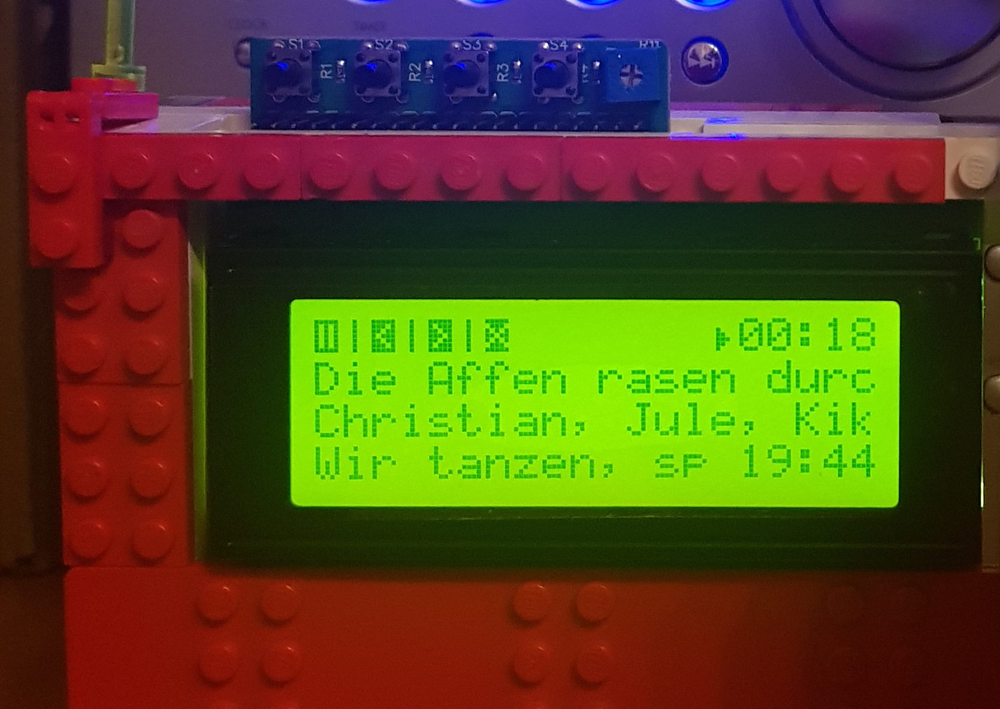

****************************
Moode-Charlcd
****************************

.. image:: https://img.shields.io/pypi/v/Moode-Charlcd
    :target: https://pypi.org/project/Moode-Charlcd/
    :alt: Latest PyPI version

.. image:: https://img.shields.io/github/workflow/status/maystar/moode-charlcd/CI
    :target: https://github.com/maystar/moode-charlcd/actions
    :alt: CI build status

.. image:: https://img.shields.io/codecov/c/gh/maystar/moode-charlcd
    :target: https://codecov.io/gh/maystar/moode-charlcd
    :alt: Test coverage

Moode extension for showing track information on a character liquid crystal display.
In combination with the `moode-raspberry-gpio <https://github.com/pimoroni/moode-raspberry-gpio>`_
extension it shows the button function, too.

This plugin is build for these `LCD-board <https://www.joy-it.net/de/products/RB-LCD-20x4>`_ and tested
with the raspberry pi 4.

Installation
============

Install by running::

    python3 -m pip install Moode-Charlcd

Configuration
=============

Moode-Charlcd is shipped with the following default configuration
which should be find for the hardware setup mentioned above::

    [charlcd]
    enabled = true
    i2c_port = 0x27
    pin_mapping_variant = 2
    num_cols = 20
    num_rows = 4

Please make sure the following configurations are present.

Map shutdown to pin 9::

    # /boot/config.txt
    dtoverlay=gpio-shutdown,gpio_pin=9,active_low=0

Map the other pins to the moode-gpio extension::

    [raspberry-gpio]
    enabled = true
    bcm4 = play_pause,active_low,250
    bcm16 = prev,active_low,250
    bcm10 = next,active_low,250

Project resources
=================

- `Source code <https://github.com/maystar/moode-charlcd>`_
- `Issue tracker <https://github.com/maystar/moode-charlcd/issues>`_
- `Changelog <https://github.com/maystar/moode-charlcd/blob/master/CHANGELOG.rst>`_

Credits
=======

- Original author: `Fabian<https://github.com/maystar>`__
- Current maintainer: `Fabian<https://github.com/maystar>`__
- `Contributors <https://github.com/maystar/moode-charlcd/graphs/contributors>`_
